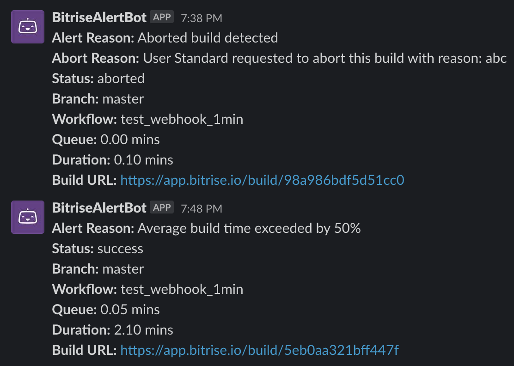
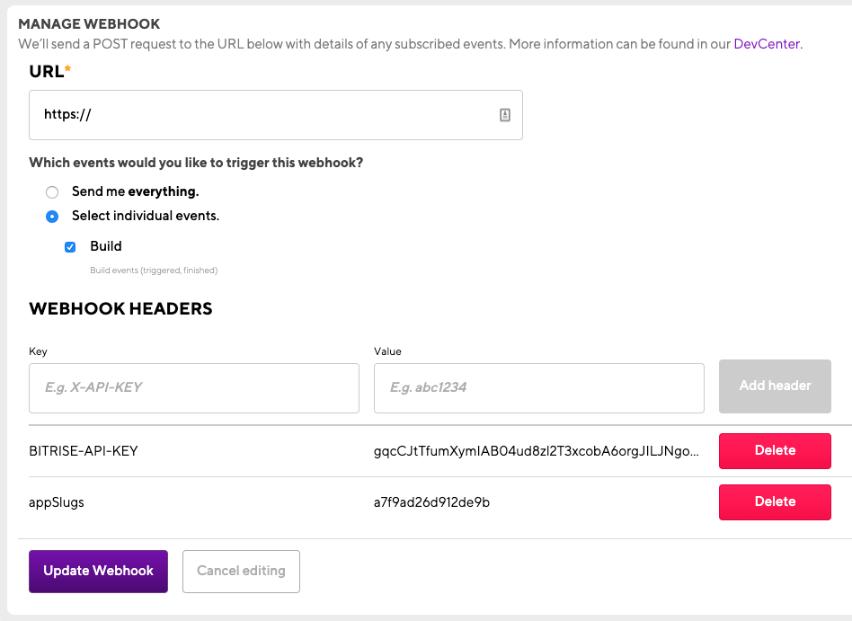

# bitrise-slack-alert-bot
Simple Rules Engine to alert when Bitrise builds meet certain conditions



# Run Locally

## Install Dependencies

```npm i```

## Running Slack Alert Bot

```node index.js```

# Run on Repl.it

[](https://repl.it/github/DamienBitrise/bitrise-slack-alert-bot)

# Configuring Bitrise Build Webhook


